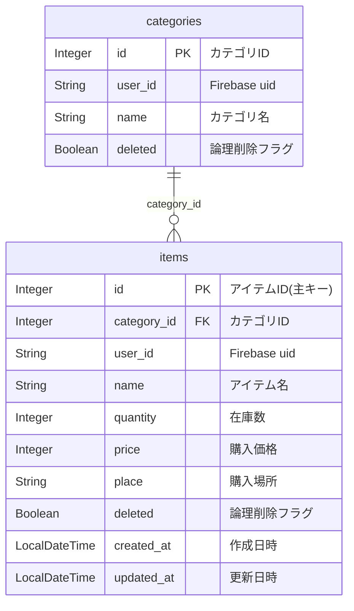

## ER図
DBに保存するデータ構造(Entity)とその関係(Relation)を記述します。

```mermaid
erDiagram

categories {
    Integer id PK "カテゴリID"
    String user_id "Firebase uid"
    String name "カテゴリ名"
    Boolean deleted "論理削除フラグ"
}

items {
    Integer id PK "アイテムID(主キー)"
    Integer category_id FK "カテゴリID"
    String user_id "Firebase uid"
    String name "アイテム名"
    Integer quantity "在庫数"
    Integer price "購入価格"
    String place "購入場所"
    Boolean deleted "論理削除フラグ"
    LocalDateTime created_at "作成日時"
    LocalDateTime updated_at "更新日時"
}

categories || --o{ items : category_id
```
