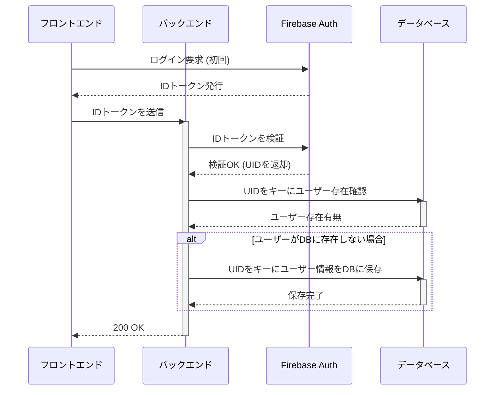
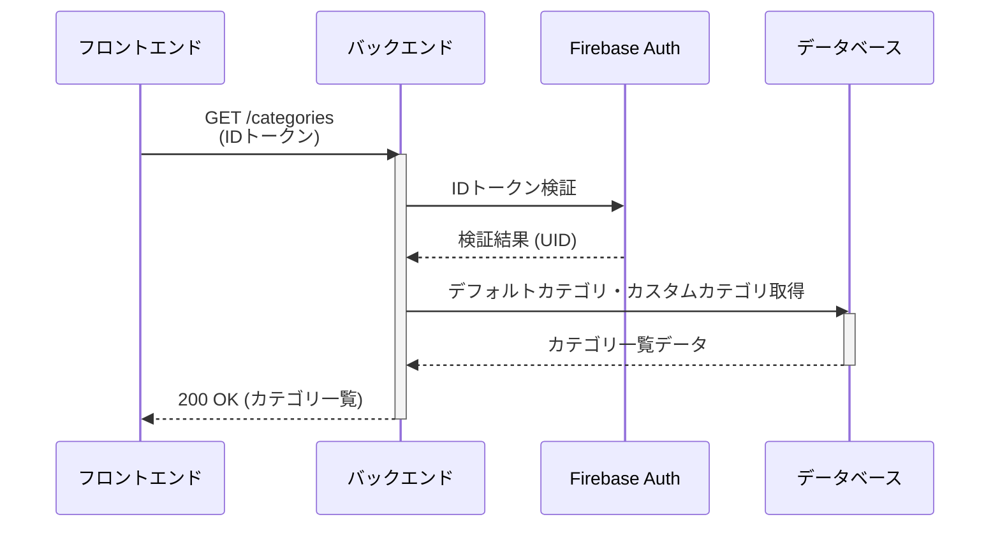
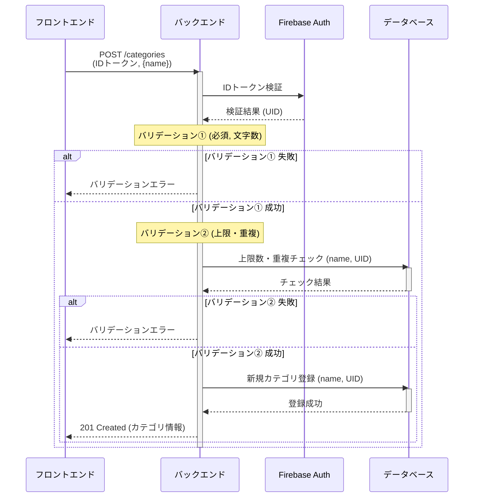
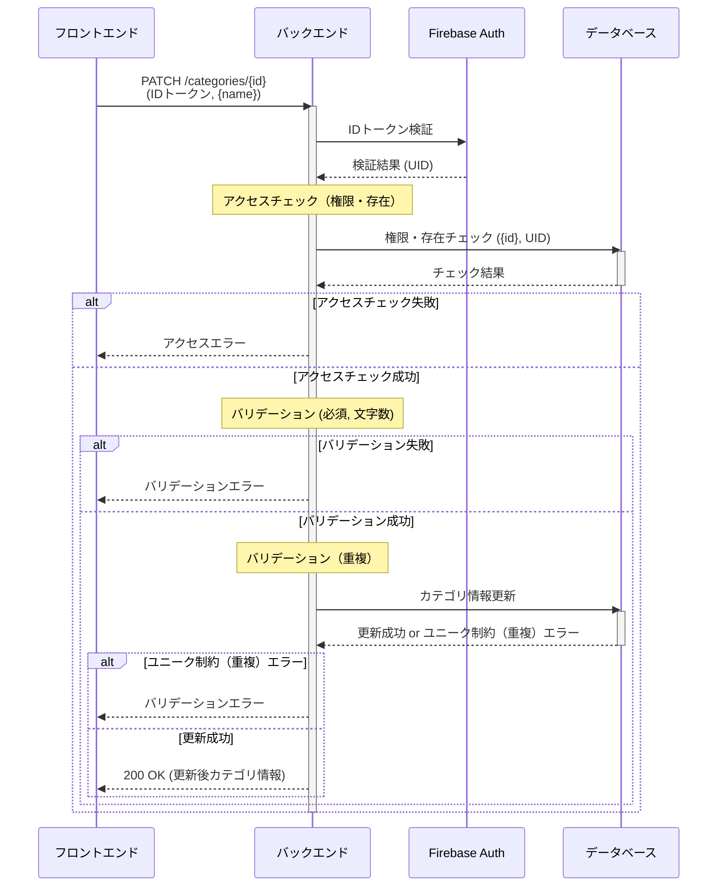
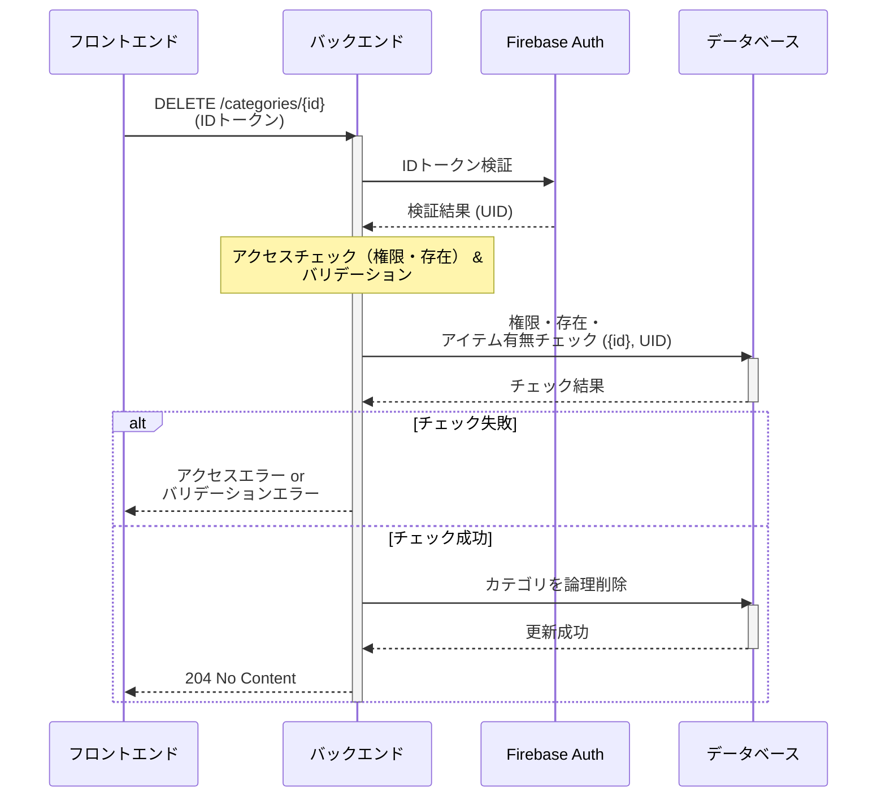
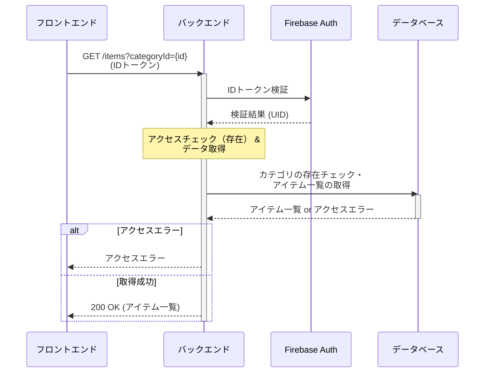
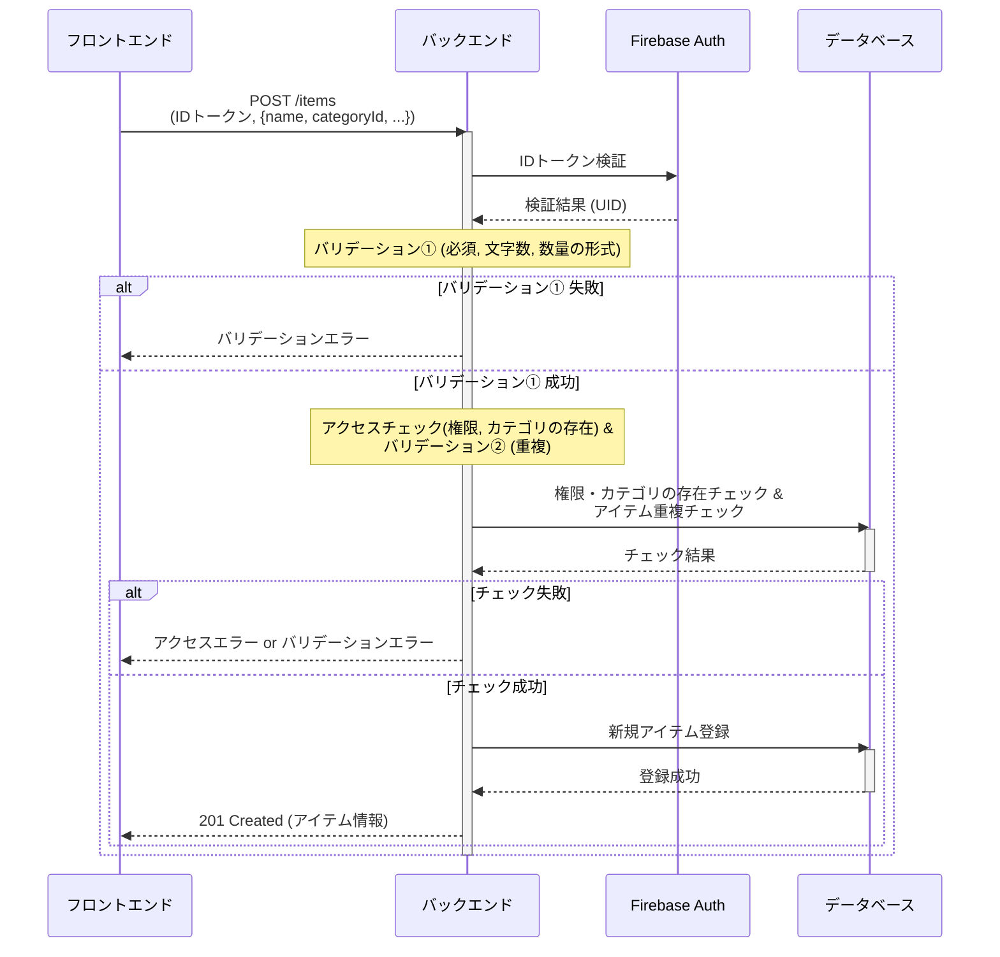
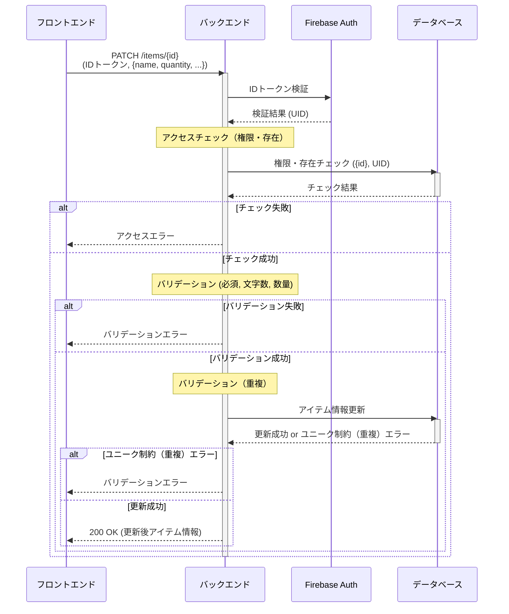
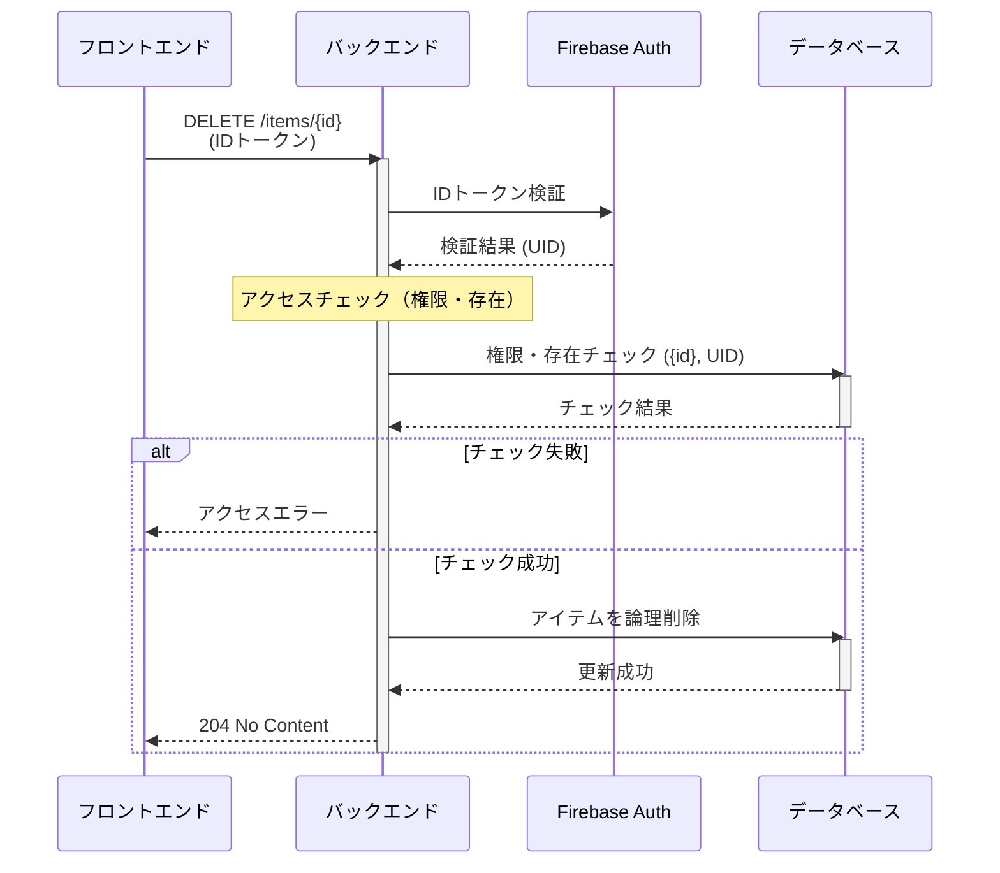

# シーケンス図
各処理のシーケンス図を記述します。

## ユーザー管理
### ユーザーのログイン認証（初回ログイン時のみ）

```mermaid
sequenceDiagram
    participant フロントエンド
    participant バックエンド
    participant Firebase Auth
    participant データベース

    フロントエンド->>Firebase Auth: ログイン要求 (初回)
    Firebase Auth-->>フロントエンド: IDトークン発行

    フロントエンド->>バックエンド: IDトークンを送信
    activate バックエンド
    バックエンド->>Firebase Auth: IDトークンを検証
    Firebase Auth-->>バックエンド: 検証OK (UIDを返却)

    バックエンド->>データベース: UIDをキーにユーザー存在確認
    activate データベース
    データベース-->>バックエンド: ユーザー存在有無
    deactivate データベース

    alt ユーザーがDBに存在しない場合
        バックエンド->>データベース: UIDをキーにユーザー情報をDBに保存
        activate データベース
        データベース-->>バックエンド: 保存完了
        deactivate データベース
    end

    バックエンド-->>フロントエンド: 200 OK
    deactivate バックエンド
```

## カテゴリ管理
### カテゴリ一覧取得

```mermaid
sequenceDiagram
    participant フロントエンド
    participant バックエンド
    participant Firebase Auth
    participant データベース

    フロントエンド->>バックエンド: GET /categories <br> (IDトークン)
    activate バックエンド
    バックエンド->>Firebase Auth: IDトークン検証
    Firebase Auth-->>バックエンド: 検証結果 (UID)

    バックエンド->>データベース: デフォルトカテゴリ・カスタムカテゴリ取得
    activate データベース
    データベース-->>バックエンド: カテゴリ一覧データ
    deactivate データベース

    バックエンド-->>フロントエンド: 200 OK (カテゴリ一覧)
    deactivate バックエンド
```

### カテゴリ新規作成

```mermaid
sequenceDiagram
    participant フロントエンド
    participant バックエンド
    participant Firebase Auth
    participant データベース

    フロントエンド->>バックエンド: POST /categories <br> (IDトークン, {name})
    activate バックエンド
    バックエンド->>Firebase Auth: IDトークン検証
    Firebase Auth-->>バックエンド: 検証結果 (UID)

    note over バックエンド: バリデーション① (必須, 文字数)

    alt バリデーション① 失敗
        バックエンド-->>フロントエンド: バリデーションエラー
    else バリデーション① 成功
        note over バックエンド: バリデーション② (上限・重複)
        バックエンド->>データベース: 上限数・重複チェック (name, UID)
        activate データベース
        データベース-->>バックエンド: チェック結果
        deactivate データベース

        alt バリデーション② 失敗
            バックエンド-->>フロントエンド: バリデーションエラー
        else バリデーション② 成功
            バックエンド->>データベース: 新規カテゴリ登録 (name, UID)
            activate データベース
            データベース-->>バックエンド: 登録成功
            deactivate データベース
            バックエンド-->>フロントエンド: 201 Created (カテゴリ情報)
        end
    end
    deactivate バックエンド
```

### カテゴリ編集

```mermaid
sequenceDiagram
    participant フロントエンド
    participant バックエンド
    participant Firebase Auth
    participant データベース

    フロントエンド->>バックエンド: PATCH /categories/{id} <br> (IDトークン, {name})
    activate バックエンド
    バックエンド->>Firebase Auth: IDトークン検証
    Firebase Auth-->>バックエンド: 検証結果 (UID)

    note over バックエンド: アクセスチェック（権限・存在）
    バックエンド->>データベース: 権限・存在チェック ({id}, UID)
    activate データベース
    データベース-->>バックエンド: チェック結果
    deactivate データベース

    alt アクセスチェック失敗
        バックエンド-->>フロントエンド: アクセスエラー
    else アクセスチェック成功
        note over バックエンド: バリデーション (必須, 文字数)
        
        alt バリデーション失敗
            バックエンド-->>フロントエンド: バリデーションエラー
        else バリデーション成功
            note over バックエンド: バリデーション（重複）
            バックエンド->>データベース: カテゴリ情報更新
            activate データベース
            データベース-->>バックエンド: 更新成功 or ユニーク制約（重複）エラー
            deactivate データベース

            alt ユニーク制約（重複）エラー
                バックエンド-->>フロントエンド: バリデーションエラー
            else 更新成功
                バックエンド-->>フロントエンド: 200 OK (更新後カテゴリ情報)
            end
        end
    end
    deactivate バックエンド
```

### カテゴリ削除

```mermaid
sequenceDiagram
    participant フロントエンド
    participant バックエンド
    participant Firebase Auth
    participant データベース

    フロントエンド->>バックエンド: DELETE /categories/{id} <br> (IDトークン)
    activate バックエンド
    バックエンド->>Firebase Auth: IDトークン検証
    Firebase Auth-->>バックエンド: 検証結果 (UID)

    note over バックエンド: アクセスチェック（権限・存在） & <br> バリデーション
    バックエンド->>データベース: 権限・存在・ <br> アイテム有無チェック ({id}, UID)
    activate データベース
    データベース-->>バックエンド: チェック結果
    deactivate データベース

    alt チェック失敗
        バックエンド-->>フロントエンド: アクセスエラー or <br> バリデーションエラー
    else チェック成功
        バックエンド->>データベース: カテゴリを論理削除
        activate データベース
        データベース-->>バックエンド: 更新成功
        deactivate データベース
        バックエンド-->>フロントエンド: 204 No Content
    end
    deactivate バックエンド

```

## アイテム管理
### アイテム一覧

```mermaid
sequenceDiagram
    participant フロントエンド
    participant バックエンド
    participant Firebase Auth
    participant データベース

    フロントエンド->>バックエンド: GET /items?categoryId={id} <br> (IDトークン)
    activate バックエンド
    バックエンド->>Firebase Auth: IDトークン検証
    Firebase Auth-->>バックエンド: 検証結果 (UID)

    note over バックエンド: アクセスチェック（存在） & <br> データ取得
    バックエンド->>データベース: カテゴリの存在チェック・<br>アイテム一覧の取得
    activate データベース
    データベース-->>バックエンド: アイテム一覧 or アクセスエラー
    deactivate データベース

    alt アクセスエラー
        バックエンド-->>フロントエンド: アクセスエラー
    else 取得成功
        バックエンド-->>フロントエンド: 200 OK (アイテム一覧)
    end
    deactivate バックエンド

```

### アイテム新規作成

```mermaid
sequenceDiagram
    participant フロントエンド
    participant バックエンド
    participant Firebase Auth
    participant データベース

    フロントエンド->>バックエンド: POST /items <br> (IDトークン, {name, categoryId, ...})
    activate バックエンド
    バックエンド->>Firebase Auth: IDトークン検証
    Firebase Auth-->>バックエンド: 検証結果 (UID)

    note over バックエンド: バリデーション① (必須, 文字数, 数量の形式)
    
    alt バリデーション① 失敗
        バックエンド-->>フロントエンド: バリデーションエラー
    else バリデーション① 成功
        note over バックエンド: アクセスチェック(権限, カテゴリの存在) & <br> バリデーション② (重複)
        バックエンド->>データベース: 権限・カテゴリの存在チェック & <br>アイテム重複チェック
        activate データベース
        データベース-->>バックエンド: チェック結果
        deactivate データベース

        alt チェック失敗
            バックエンド-->>フロントエンド: アクセスエラー or バリデーションエラー
        else チェック成功
            バックエンド->>データベース: 新規アイテム登録
            activate データベース
            データベース-->>バックエンド: 登録成功
            deactivate データベース
            バックエンド-->>フロントエンド: 201 Created (アイテム情報)
        end
    end
    deactivate バックエンド
```

### アイテム編集

```mermaid
sequenceDiagram
    participant フロントエンド
    participant バックエンド
    participant Firebase Auth
    participant データベース

    フロントエンド->>バックエンド: PATCH /items/{id} <br> (IDトークン, {name, quantity, ...})
    activate バックエンド
    バックエンド->>Firebase Auth: IDトークン検証
    Firebase Auth-->>バックエンド: 検証結果 (UID)

    note over バックエンド: アクセスチェック（権限・存在）
    バックエンド->>データベース: 権限・存在チェック ({id}, UID)
    activate データベース
    データベース-->>バックエンド: チェック結果
    deactivate データベース

    alt チェック失敗
        バックエンド-->>フロントエンド: アクセスエラー
    else チェック成功
        note over バックエンド: バリデーション (必須, 文字数, 数量)
        
        alt バリデーション失敗
            バックエンド-->>フロントエンド: バリデーションエラー
        else バリデーション成功
            note over バックエンド: バリデーション（重複）
            バックエンド->>データベース: アイテム情報更新
            activate データベース
            データベース-->>バックエンド: 更新成功 or ユニーク制約（重複）エラー
            deactivate データベース

            alt ユニーク制約（重複）エラー
                バックエンド-->>フロントエンド: バリデーションエラー
            else 更新成功
                バックエンド-->>フロントエンド: 200 OK (更新後アイテム情報)
            end
        end
    end
    deactivate バックエンド
```

### アイテム削除

```mermaid
sequenceDiagram
    participant フロントエンド
    participant バックエンド
    participant Firebase Auth
    participant データベース

    フロントエンド->>バックエンド: DELETE /items/{id} <br> (IDトークン)
    activate バックエンド
    バックエンド->>Firebase Auth: IDトークン検証
    Firebase Auth-->>バックエンド: 検証結果 (UID)

    note over バックエンド: アクセスチェック（権限・存在）
    バックエンド->>データベース: 権限・存在チェック ({id}, UID)
    activate データベース
    データベース-->>バックエンド: チェック結果
    deactivate データベース

    alt チェック失敗
        バックエンド-->>フロントエンド: アクセスエラー
    else チェック成功
        バックエンド->>データベース: アイテムを論理削除
        activate データベース
        データベース-->>バックエンド: 更新成功
        deactivate データベース
        バックエンド-->>フロントエンド: 204 No Content
    end
    deactivate バックエンド
```
